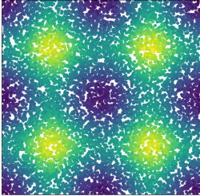
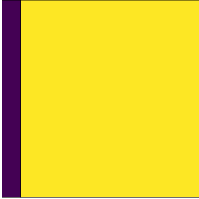
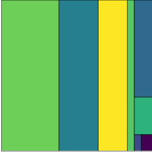
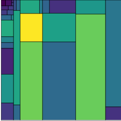
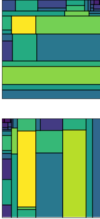
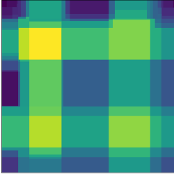
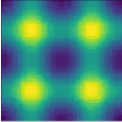

Random forests are great. They're easy to train, they don't care about outliers, and they have very few assumptions. You can use random forests for almost any problem you come across and, chances are, you'll end up with a fairly decent predictive model.

But what do random forests actually do? You might have heard something about random forests being "an average of decision trees", but what does that mean? This post will explain random forests. We'll start off with decision trees and gradually work our way up to random forests. And - best of all - we'll do it all with pictures! No maths, no code, just pretty pictures.

# The Problem

Look at this picture:

It's a bunch of different coloured points. For the rest of this post, we're going to try to **predict the colour of a point, given its location**.

This sounds like a daft made up problem, but it's not too different to the sort of problems you'll see in the 'real world'. You have two dependent variables (the $x$ and $y$ coordinates of a point), and you want to predict a continuous variable (colour). It's a regression problem.

There's a fair bit of structure to this data:

* there are 4 bright horizontal & vertical lines, and they sort of look like a hashtag
* there are 4 bright spots where the bright lines overlap

A good model should be able to capture this structure. 

Instead of just jumping straight to random forests, we're going to start with a slightly simpler model - *decision trees*.

# Decision Trees

A decision tree is a sequence of yes/no questions. Each of these yes/no questions 'split' the dataset into smaller and smaller chunks. The idea behind decision trees is that, by splitting the data down into small groups, each group will contain data points which are fairly similar to each other. Since the points in each group are fairly similar to each other, the average value in each group will be fairly close to the actual value of each point. This is how predictions are made using decision trees - figure out which group a new data point is in, then predict the average value for that group.

Here's how our data looks to a simple decision tree:

Clearly, this isn't the best model in the world. It hasn't picked up any of the patterns in the data and only ever predicts two values - the model thinks any point on the far left is purple, and all other points are yellow. This is because we've fit a very *shallow* decision tree. The tree is only allowed to make one split, so the best it'll ever be able to do is split the data into two smaller chunks. If we let the tree make more splits it'll be able to make smaller chunks of the data, so it should be able to pick up more of the underlying patterns in the data.

Here's how our data looks to a tree of depth 3:

This is slightly better. It's picked up the bright band on the right hand side, and it's figured out that the bottom right corner is a darker colour than the other areas. There's still a lot of patterns which the model hasn't picked up however.

Here's how the data looks to a tree of depth 5:

Now we're getting somewhere! The model has picked up the two bright vertical bands, has figured out that there is a very bright spot on the left, and has noticed that points in the corners are darker than the rest of the points.

Increasing the tree depth increases the number of splits. This means the tree is able to split the dataset into smaller regions. This increased *flexability* lets the model find more complex patterns in the data.

You might be temped to keep on increasing the depth of the tree, since it looks like deeper trees make better predictions. This is true, but you need to be careful that you don't start *overfitting* your data. Imagine if you made an incredibly deep tree, so deep that each data point was in it's own group. The predictions from the tree would be absolutely perfect since each point is in it's own group, and so the average value for the group - the predicition - will be exactly the same as the actual value of the point. But this model hasn't actually found any patterns in the data, it's just memorised the value for each datapoint! The goal of machine learning is to figure out patterns in data, then use those patterns to make predictions about new data.

One particularly nice feature about decision trees is what questions they ask when splitting data. The questions are always things like *'is x less than 50?'* or *'is z bigger than 264?'*. This is really nice because it means that *decision trees don't care about outliers*. They don't care about the actual value of a datapoint, only if that value is above/below some threshold value.

# Random Forests

There's only one downside to decision trees - the predictions they make aren't amazing. The predictions are quite accurate, but not as accurate as some of the other fancy machine learning models out there. Fortunately there's a trick we can do to get much more accurate predictions out of decision trees - **ensembling**.

The idea behind ensembling is really simple. Imagine you have loads of different models. You can make predictions with each of these models, giving you a bunch of predictions. Each of these predictions will have an *error* associated with them. If these errors are

*  *independent*  - that is, if knowing something about the error of one prediction doesn't tell you anything about the error of another prediction,  and 
* *random* - that is, the errors of each model predictions aren't systematically large/small for particular groups of data

Then averaging the predictions will give you a *more accurate prediction*.

So we need a bunch of models, which are all independent from each other. Can we do something to our data to end up with loads of independent decision trees? If we can, then we can just average the predictions from each of these trees and get a much better model.

Remember what decision trees do - they split the dataset into smaller regions, then make predictions based on which region a point falls into. The splits depend on the underlying patterns in the dataset. If the dataset changes, then the small regions will also change. If we were to take a *random sample* of the data, we would get a *different* decision tree.

Let's give that a go. Here's two decision trees, each fit to a different random sample of the data:

They look like very different models, so we can ensemble them. Here's the average of the predictions from the two models:

That looks very similar to the original data! It's picked up the bright lines & bright spots, so it's managed to find the structure in the data.

This average model is a **random forest**. Here's the steps for building a random forest:

1. Get some data
2. Take *random* samples of the data
3. Build a decision tree on each of the random samples
4. Make predictions with each of the decision trees
5. Average the predictions

# Improving The Forest

Now that we've built a random forest, can we make it better? Broadly, there are three ways of improving the performance of an ensemble model:

* Increase the number of models in the ensemble. More models gives you more opportunities to spot patterns in the data
* Improve the performance of the underlying model. For us, that'd mean improving the decision trees (by increasing the depth for example)
* Make the models more uncorrelated with each other. If the models are more uncorrelated with each other, then they're going to be more independent, so the ensemble should be more accurate

Random forests do all sorts of tricks to make the models more uncorrelated with each other. The best trick (and one you need to know about) is that the forest *isn't allowed to split on the same variables at each split*. Every time the model needs to make a split, it randomly chooses a handful of features to split on. This reduces the chances of several trees splitting on the same feature at the same point, which makes the trees less similar to each other.

All random forest algorithms let you decide how many features you want to consider at each split. There's a couple of default values which are good to try out if you're not sure - for classification problems, it's best to try using $\sqrt{n_{features}}$. For regression, try out $n_{features}$.

There's only two features in our dataset (the x & y coordinates), so it doesn't look like there's much we can do to make the trees more uncorrelated with each other. Let's try out the other two bulletpoints.

Here's a random forest model with *1000 trees*. Each tree has *depth 15*, so can split the dataset up into lots of little rectangular regions:

Looks good! This has found the bright lines & spots (same as before), but now it's figured out that the spots are all the same colour. Also, the spots look like actual spots. They're round! It's pretty amazing that round regions have appeared, considering that the decision trees in the ensemble can only ever make rectangular regions. Given enough flexibility (tree depth), random forests are able to fit *arbitrarily complex* patterns in data.

# Wrap Up

In this post we've seen:

* Decision trees split datasets up into lots of little rectanglular regions
* Decision trees make predictions by figuring out which rectangular region a new data point is in, then predicting the average value of that region
* Averaging predictions will give you a better prediction, provided that the predictions are independent from each other and have random errors. This is called ensembling
* You can easily make lots of uncorrelated models by training decision trees on different samples of data
* Averaging these decision trees makes a random forest
* Ensembles can be improved by increasing the number of models in the ensemble, increasing the performance of the models in the ensemble, or by making the models less correlated with each other

That's a lot of stuff! If you want to learn more about random forests, have a read over the [original paper](https://www.stat.berkeley.edu/users/breiman/randomforest2001.pdf) which introduced the idea. If you like the idea of ensembles, have a look at this RSS talk  
  [bag of little bootstraps](https://www.youtube.com/watch?v=9v6cMnFNiOI) by Michael Jordan. If you want to see another random forest algorithm which introduces even more randomness into the decision trees, check out [extremly randomised trees](https://scikit-learn.org/stable/modules/generated/sklearn.ensemble.ExtraTreesClassifier.html).

Finally, if you're interested in the code used to make these models & graphs, my workings are in  
  [this notebook](https://github.com/sm212/sm212.github.io/blob/master/notebooks/random_forest.ipynb).