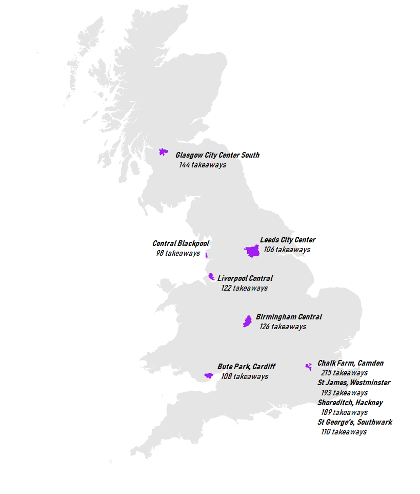

```{r setup, include=FALSE, echo=F, warning=F}
knitr::opts_chunk$set(warning = F, message = F)
```

If you love fast food, where should you live? You'd want to live somewhere with *lots of takeaways*, ideally all *fairly close to each other*. Lucky for you, there's a fair bit of choice! If you want to live in England then London's you're best bet, or you can go to the midlands (Birmingham) or up North (Blackpool or Leeds). If you're looking for a place to live in Wales, Bute Park in Cardiff has loads of takeaways, and for Scotland you can't go wrong with Central Glasgow:



The rest of this post is going to walk through the steps for the analysis - we're going to scrape some info from the Food Standards Agency, and do a bit of geospatial work to figure out where the fast food hotspots are.

# Getting data

The [Food Standards Agency](https://www.food.gov.uk/about-us/who-we-are?navref=main) are responsible for inspecting food businesses in the UK. FSA are a very open organisation. Their board meetings are [open to the public](https://www.food.gov.uk/about-us/fsa-board-meeting-june-2020), internal strategy documents are available for [anyone to read](https://www.food.gov.uk/sites/default/files/media/document/Food-Standards-Agency-Strategy%20FINAL.pdf), and they [publish their data](https://data.food.gov.uk/catalog). They publish information on [every inspection ever done](https://ratings.food.gov.uk/open-data/en-GB), and they update the data every day. We're going to use these records to find the fast food capital.

The FSA provide the data in XML files, with one file per local authority. We're going to have to do a bit of data cleaning to get the data out of these XML files before we can do any analysis. Let's load some libraries & get started:

```{r}
library(tidyverse)
library(rvest)
library(xml2)
library(sf)
library(httr)
```

First thing to do is get all the URLs for the datasets. Some of the datasets are provided in English & Welsh, so we need to make sure we just get the English ones to avoid double counting. Looking at the first few URLs, all the datasets end in `en-GB.xml` which makes them easy to find:

```{r}
fsa_url = 'https://ratings.food.gov.uk/open-data/en-GB'
fsa_html = read_html(fsa_url)

# Get all valid URLs
urls = fsa_html %>%
  html_nodes('a') %>%
  html_attr('href')
urls = urls[!is.na(urls)]

# Filter to dataset URLs
msk = urls %>%
  str_detect('en-GB.xml')
datasets = urls[msk]
```

Now we need to get the XML data into a format R knows how to work with. Different XML files can have very different structures, so there isn't a nice `xml_to_dataframe` function which will do all the work for us. The `xml2` package makes it easy to traverse XML files, but we're going to have to pull the relevant bits of data ourselves.

The `xml_field` function below returns all data contained in any node with a `field` XPath. The heavy lifting is done by `xml_find_all` which does the extraction, the rest of the code converts the data into strings & removes any extra tags or newlines. Making the dataframe then boils down to using `xml_field` to get vectors for a couple of fields, then sticking the vectors together into a dataframe. That's exactly what `xml_to_df` does:

```{r}
xml_field = function(xml, field){
  xml_find_all(xml, paste0('.//', field)) %>% 
  as.character() %>%
  str_replace_all('<.*?>\\n?', '') 
}

xml_to_df = function(xml){
  fields = c('BusinessName', 'BusinessType', 'SchemeType', 
             'RatingValue', 'RatingDate', 
             'LocalAuthorityName', 'Geocode')
  
  cols = vector('list', 7)
  for (i in 1:7){
    cols[[i]] = xml_field(xml, fields[[i]])
  }
  
  df = bind_cols(cols)
  names(df) = c('business_name', 'business_type', 'scheme_type', 
                'rating_value','rating_date', 'la', 'geocode')
  
  return(df)
}
```

Getting the data for each local authority is easy enough - just pass the XML through the `xml_to_df` function:

```{r eval=F}
df = datasets %>%
  map(read_xml) %>%
  map(xml_to_df) %>%
  bind_rows()
```

```{r include=F}
df = read_csv('../../../cache/fsa_data.csv')
```

Here's the first few rows:

```{r echo = F, results = 'asis'}
head(df) %>%
  kableExtra::kable()
```

There's one last little bit we need to fix. The `geocode` column contains longitude/latitude coordinates, separated by whitespace (like `long lat`). Let's get them into separate columns:

```{r}
df = df %>%
  mutate(geocode = ifelse(str_length(geocode) > 0, 
                          str_trim(geocode),
                          NA)) %>%
  separate(geocode, into = c('long', 'lat'), sep = '\\s+') %>%
  mutate(lat = as.double(lat),
         long = as.double(long))
```

And we're ready to go! All together this dataset contains information on over 540,000 food outlets across the UK, so it's fairly comprehensive!

Since we're looking at fast food outlets only, it seems like a good idea to just look at any outlet classed as a 'Takeaway/sandwich shop'. If we do that then we'd look at `r format(sum(df$business_type == 'Takeaway/sandwich shop'), big.mark = ',')` food outlets across the country. Before we do this, let's quickly check what fast food outlets are calling themselves. Here's KFC:

```{r echo = F}
df %>%
  filter(str_detect(business_name, 'KFC')) %>%
  count(business_type) %>%
  mutate(business_type = fct_reorder(business_type, n)) %>%
  ggplot(aes(business_type, n)) +
  geom_col() +
  coord_flip() +
  theme_minimal() +
  theme(text = element_text(size = 14)) +
  labs(x = NULL, y = NULL, title = "KFC is a restaurant apparently")
```

Most KFCs are classed as restaurants! If we only looked at outlets classed as takeaways, we'd miss all these and end up undercounting the number of fast food outlets.

If we want a proper count, We're going to have to pick out these missed takeaways based on the outlet names. There's loads of ways to do this, but I feel this is a fairly reasonable list of outlets we can call takeaways:

* Any of the big takeaway chains - McDonalds, KFC, Pizza Hut, so on...
* Any mention of common takeaway words - any business name containing 'kebab', 'burger', 'chicken', 'pizza', ...

We'll also throw out a couple of business types which might get picked up through this matching process - there's no point including any farmers / growers as takeaways!

```{r}
# Phrases to include
chains = c('mcdonald', 'kfc', 'kentucky fried chicken', 
           'subway', 'greggs', 'domino', 'papa johns', 'dixy')
words = c('kebab', 'pizza', 'chinese', 'china', 'peking', 
          'oriental','indian', 'curry', 'chicken', 
          'chip', 'fish', 'burger')

# Business types to exclude
type_exc = c('Pub/bar/nightclub', 
             'Hospitals/Childcare/Caring Premises',
             'School/college/university', 
             'Hotel/bed &amp; breakfast/guest house', 
             'Farmers/growers', 'Distributors/Transporters', 
             'Manufacturers/packers', 'Importers/Exporters', 
             'Other catering premises', 
             'Retailers - supermarkets/hypermarkets')

chain_regex = paste(chains, collapse = '|')
word_regex = paste(words, collapse = '|')
type_regex = paste(type_exc, collapse = '|')


takeaways = df %>% 
  mutate(name_lower = str_to_lower(business_name),
         valid_chain = str_detect(name_lower, chain_regex),
         valid_word = str_detect(name_lower, word_regex),
         valid_type = !str_detect(business_type, type_regex)) %>%
  filter(business_type == 'Takeaway/sandwich shop' | 
           valid_chain | valid_word, valid_type)
```

```{r include = F}
total_mcd = df %>%
  filter(str_detect(tolower(business_name), 'mcdonald')) %>%
  nrow()

found_mcd = takeaways %>%
  filter(str_detect(tolower(business_name), 'mcdonald')) %>%
  nrow()

pct_mcd = round(100 * found_mcd / total_mcd, 2)

total_kfc = df %>%
  filter(str_detect(business_name, 'KFC')) %>%
  nrow()

found_kfc = takeaways %>%
  filter(str_detect(business_name, 'KFC')) %>%
  nrow()

pct_kfc = round(100 * found_kfc / total_kfc, 2)
```

Our extra matching work has increased the number of takeaways found to `r format(nrow(takeaways), big.mark = ',')`.  
  This new method finds `r pct_kfc`% of all KFCs, and `r pct_mcd`% of all McDonalds, so we can be fairly confident that we're not missing anything major.

# Analysis

## Takeaway density

We're looking for somewhere with lots of takeaways, all fairly close to each other. The easiest way of measuring this is to count the total number of takeaways in each local authority, then divide by the size of the local authority. This will give the *takeaway density* - the number of takeaways per area.

We're going to need the area of each local authority before we can compute this. Computing areas requires us to work with *shapefiles* - specific data formats which encode geographic information. Shapefiles for most of the UK are available from the ONS geoportal, and the one we want is the [2020 local authority boundaries](https://geoportal.statistics.gov.uk/datasets/local-authority-districts-may-2020-boundaries-uk-bfe). If you click that link there's a little API button, you can copy the geoJSON link & pass it directly to `read_sf` (saves you messing about downloading & extracting stuff):

```{r}
la_shp = read_sf('https://opendata.arcgis.com/datasets/69dc11c7386943b4ad8893c45648b1e1_0.geojson')
```

Areas can be calculated using the `st_area` function from the `sf` package:

```{r}
areas = la_shp %>%
  mutate(area = st_area(la_shp)) %>%
  st_set_geometry(NULL) %>%
  select(LAD20NM, area)
```

It's slightly tricky to join this data to our takeaways data, since the only common variable we can use is the name of the local authority. Some local authorities have slightly different names in the two datasets - overall there are `r length(unique(takeaways$la)[!unique(takeaways$la) %in% la_shp$LAD20NM])` areas which don't match. We're going to have to do a bit of work fixing the names before we can continue. I won't include the code here because it's not very interesting - just getting rid of the word 'City' and then manually renaming things by hand.  
  Once we sort the names out, we just add the area numbers to our data & compute the densities:

```{r include = F}
name_lookup = data.frame(la = unique(takeaways$la)) %>%
  mutate(la_name = str_replace(la, 'On', 'on'),
         la_name = str_replace(la_name, ' City$', ''),
         la_name = case_when(
           la_name == 'City of London Corporation' ~ 'City of London',
           la_name == 'Kingston-Upon-Thames' ~ 'Kingston upon Thames',
           la_name == 'Richmond-Upon-Thames' ~ 'Richmond upon Thames',
           la_name == 'Durham' ~ 'County Durham',
           la_name == 'Newcastle Upon Tyne' ~ 'Newcastle upon Tyne',
           la_name == 'Stockton on Tees' ~ 'Stockton-on-Tees',
           la_name == 'Blackburn' ~ 'Blackburn with Darwen',
           la_name == 'St Helens' ~ 'St. Helens',
           la_name == 'Bristol' ~ 'Bristol, City of',
           la_name == 'Herefordshire' ~ 'Herefordshire, County of',
           la_name == 'Newcastle-Under-Lyme' ~ 'Newcastle-under-Lyme',
           la_name == 'Telford and Wrekin Council' ~ 'Telford and Wrekin',
           la_name == 'Hull' ~ 'Kingston upon Hull, City of',
           la_name == 'Edinburgh (City of)' ~ 'City of Edinburgh',
           la_name == 'Anglesey' ~ 'Isle of Anglesey',
           la_name == 'Aberdeen' ~ 'Aberdeen City',
           la_name == 'Dundee' ~ 'Dundee City',
           la_name == 'Glasgow' ~ 'Glasgow City',
           la_name == 'Comhairle nan Eilean Siar (Western Isles)' ~ 'Na h-Eileanan Siar',
           T ~ la_name))

takeaways = takeaways %>%
  inner_join(name_lookup)
```

```{r}
per_area = takeaways %>%
  group_by(la_name) %>%
  summarise(n_takeaway = n()) %>%
  ungroup() %>%
  left_join(areas, by = c('la_name' = 'LAD20NM')) %>%
  mutate(area = as.double(area) / (1e3)^2, # Change units to km
         rate = n_takeaway / area,
         uk_rate = sum(n_takeaway) / sum(area))
```

```{r echo = F}
per_area %>%
  arrange(desc(rate)) %>%
  head(10) %>%
  mutate(la_name = fct_reorder(la_name, rate)) %>%
  ggplot(aes(la_name, rate)) +
  geom_point() +
  coord_flip() +
  labs(x = NULL, y = NULL, 
       title = 'Average number of takeaways in 1 square kilometer',
       subtitle = 'Top 10 areas with the highest takeaway density') +
  theme_minimal()
```

City of London's number is *huge*, but that's just because City of London is a weird place. It's slightly under 2 square miles & is mostly made up of offices for financial firms, only about 9,000 people live there total. This makes City of London's fast food density huge (because we're dividing by area). We should probably ignore City of London from here on out.

One other interesting thing though - the top 10 fast food density areas are all in London. This is for a roughly similar reason to why City of London's number is so big. All the London boroughs are fairly small & tend to have very high populations. The high populations make it more likely that there will be more takeaways (because more potential customers), and the small areas make the densities overly large.

## By proximity

Instead of looking across an entire geography, why not look at all takeaways within a certain distance of each other? This is very similar to the per area numbers we just looked at, but now we're looking at *the same sized areas*. This sidesteps the issues we ran into with the per area numbers when geographies were really small / large. It's a bit of a faff to compute this number but it's nothing complex. Let's walk through computing this number for Salford, then we'll stick everything into a function & compute the number for the rest of the country.

First of all we need to pick a random point, and draw a 1km radius circle around it. These circles are called *buffers* if you want to sound fancy, and can be calculated using the `st_buffer` function:
```{r include = F}
set.seed(54929)
```

```{r eval = F}
salford = la_shp %>% 
  filter(LAD20NM == 'Salford') %>%
  st_transform(29902) # Convert units to meters

# Pick a point
pnts = st_sample(salford, 1, type = 'hexagonal')

# Make 1km buffer around it
buffers = st_buffer(pnts, dist = 1e3)

# Plot it
ggplot() +
  geom_sf(data = salford) +
  geom_sf(data = buffers, alpha = 0.2, fill = 'purple') +
  geom_sf(data = pnts)
```

```{r echo = F}
salford = la_shp %>% 
  filter(LAD20NM == 'Salford') %>%
  st_transform(29902) # Convert units to meters

# Pick a point
pnts = st_sample(salford, 1, type = 'hexagonal')

# Make 1km buffer around it
buffers = st_buffer(pnts, dist = 1e3)

# Plot it
ggplot() +
  geom_sf(data = salford) +
  geom_sf(data = buffers, alpha = 0.2, fill = 'purple') +
  geom_sf(data = pnts) +
  coord_sf(datum = NA) +
  theme_void()
```


`st_buffer` will use the coordinate system of the shapefile to draw the buffer. Our shapefile uses long/lat to measure distance, which is a bit weird to work with. The line `st_transfrom(29902)` transforms the shapefile into a coordinate system which measures distances in meters.

Next we need to see how many takeaways are inside this buffer. This is done by counting how many points *intersect* the buffer. The `sf` package has a `st_intersection` function which will calculate this for you:

```{r}
# Convert takeaways to a simple features object, with the same CRS as the
# shapefile
salford_takeaways = takeaways %>%
  filter(la_name == 'Salford',
         !is.na(long), !is.na(lat))  %>%
  st_as_sf(coords = c('long', 'lat')) %>%
  st_set_crs(st_crs(la_shp)) %>%
  st_transform(29902)

# Count how many points are inside the buffer
in_buffer = st_intersection(salford_takeaways, buffers)
n_in = length(in_buffer)
```

```{r echo = F}
ggplot() +
  geom_sf(data = salford) +
  geom_sf(data = buffers, alpha = 0.2, fill = 'purple') +
  geom_sf(data = salford_takeaways) +
  coord_sf(datum = NA) +
  theme_void()
```


And we're done! There are `r n_in` takeaways within the purple buffer.

Now all we need to do is repeat this for a bunch of different points, all across the UK.
Let's bundle those previous steps up into a function:

```{r}
nearby_takeaways = function(la_name, shp, df, dist = 1e3){
  la_shp = shp %>% 
  filter(LAD20NM == la_name) %>%
  st_transform(29902) 
  
  n_buffer = max(1, as.integer(st_area(la_shp) / (pi * dist ^ 2)))
  
  # Get data
  df_la = df %>%
  filter(la == la_name,
         !is.na(long), !is.na(lat))  %>%
  st_as_sf(coords = c('long', 'lat')) %>%
  st_set_crs(4326) %>%
  st_transform(29902)

  # Sample points & generate buffers
  pnts = st_sample(la_shp, n_buffer, type = 'hexagonal')
  buffers = st_buffer(pnts, dist = dist)

  # Count
  n_takeaways = vector('integer', length(pnts))
  for (i in 1:length(pnts)){
    n_takeaways[[i]] = length(st_intersection(buffers[i], df_la))
  }

  out = as.data.frame(st_coordinates(pnts))
  out$la = la_name
  out$takeaways = n_takeaways
  return(out)
}
```

Now we just run the code for every local authority across the country (except City of London):

```{r eval=F}
las = unique(takeaways$la_name)
la_dfs = vector('list', length = length(las))

for (i in 1:length(las)){
  if (las[[i]] == 'City of London'){
    cat(i, 'of', length(las), 'City of London - skipping\n')
  } else{
    cat(i, 'of', length(las), las[[i]], '\n')
    la_dfs[[i]] = nearby_takeaways(las[[i]], la_shp, takeaways)  
  }
}

df_proximity = bind_rows(la_dfs)
```

```{r include=F}
df_proximity = read_csv('../../../cache/takeaway_proximity.csv')
```

And we can look at the top 10 areas with lots of takeaways - there's still a lot of ones in London (makes sense since the number of takeaways are so high in those areas) - but there's a few areas we missed. In fact, outside of London almost all of the high takeaway areas are in the North of the country. Here's the top 10 areas:

```{r echo = F}
top10 = df_proximity %>%
  group_by(la) %>%
  summarise(takeaways = max(takeaways)) %>%
  arrange(desc(takeaways)) %>%
  slice(1:10) %>%
  left_join(df_proximity)

top10 %>%
  kableExtra::kable()
```


Alright so we know where in the UK has the most fast food places, but where in these areas should we go? We have the XY coordinates, but that's not very interpretable.  
  To present this in a nicer format, we're going to figure out which MSOA each point is in (an MSOA is an area of about 8,000 people), and use the [House of Commons Library MSOA names](https://visual.parliament.uk/msoanames) to make the output a bit more readable.
  
All we need to do is figure out which MSOA each point is in, then join the MSOA codes onto the  house of commons data to get the MSOA name:

```{r}
msoa_names = read_csv('https://visual.parliament.uk/msoanames/static/MSOA-Names-Latest.csv')

top10 = st_as_sf(top10, coords = c('X', 'Y')) %>%
  st_set_crs(29902)

msoa_shp = read_sf('https://opendata.arcgis.com/datasets/1382f390c22f4bed89ce11f2a9207ff0_0.geojson') %>%
  st_transform(29902)

top10 = top10 %>%
  st_join(msoa_shp) %>%
  left_join(msoa_names, by = c('MSOA11CD' = 'msoa11cd')) 

top10 %>%
  select(`Local Authority` = la, Area = msoa11hclnm, Takeaways = takeaways) %>%
  st_set_geometry(NULL) %>%
  kableExtra::kable()
```

Glasgow doesn't have a nice name - this is because MSOAs are based on the ONS census which covers England & Wales, there is a separate Scottish census. The Scottish version of MSOAs are datazones, and they all already have nice names. The datazone shapefile is available from the [ScotGov website](https://www.spatialdata.gov.scot/geonetwork/srv/eng/catalog.search#/home). Let's grab the Scotland shapefile and find the missing name:

```{r}
tempf = tempfile(fileext = '.zip')
tempd = tempdir()

g = GET('https://maps.gov.scot/ATOM/shapefiles/SG_DataZoneBdry_2011.zip', write_disk(tempf))
unzip(tempf, exdir = tempd)

fpath = paste0(tempd, '/SG_DataZone_Bdry_2011.shp')
datazone_shp = read_sf(fpath) %>%
  st_transform(29902)
```

And our table is finally finished:
```{r}
missing_name = top10 %>%
  filter(is.na(msoa11hclnm)) %>%
  st_join(datazone_shp) %>% 
  st_set_geometry(NULL) %>%
  select(la, takeaways, geog_code = DataZone, name = Name) 

not_missing = top10 %>%
  filter(!is.na(msoa11hclnm)) %>%
  st_set_geometry(NULL) %>%
  select(la, takeaways, geog_code = MSOA11CD, name = msoa11hclnm) 

top10_names = bind_rows(list(missing_name, not_missing)) %>%
  mutate(name = str_replace_all(name, ' - .*', ''))

top10_names %>%
  kableExtra::kable()
```

### The map

Here's the full code to make the map at the top of the post. I find it's way easier to save the plot (with no annotations) on, then add the annotations by hand:

```{r}
outline = la_shp %>%
  filter(substr(LAD20CD, 1, 1) != 'N') %>%
  st_transform(29902)

top10_la = la_shp %>%
  st_transform(29902) %>%
  filter(LAD20NM %in% top10$la)
  
ggplot() +
  geom_sf(data = outline, colour = NA) +
  geom_sf(data = top10_la, fill = 'purple', colour = NA) +
  coord_sf(datum = NA) +
  theme_void() +
  ggsave('test.png', height = 8, width = 5, units = 'in', dpi = 300)
```
