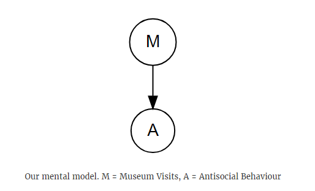
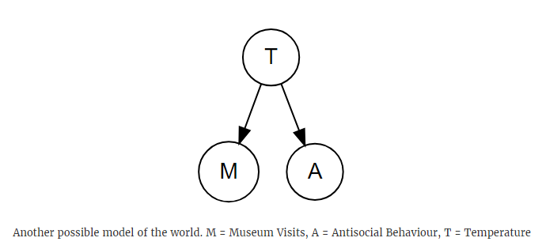
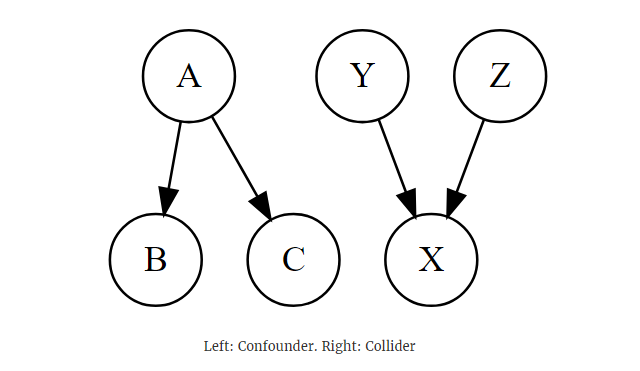
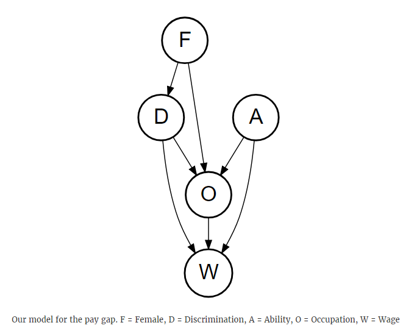

If you’ve ever used linear regression, you’ve probably came across statements like “a one unit increase in $x$ causes a $\beta$ increase in $y$”. But is this always the right thing to say? How can you be sure that changing $x$ causes $y$ to change?

A few months ago I went on a two day “causal inference workshop”, ran by the fabulous Economics Professor [Scott Cunningham](http://scunning.com/). I have zero background in economics, but Scott is a great teacher and I learnt a lot from the workshop (even if it did feel like drinking from a firehose at times!). One thing which really stuck with me is Scott’s use of DAGs - Directed Acyclic Graphs - and how they can be used to help clarify the “mental model” you use when you’re trying to do inference.

It’s easiest to show how DAGs work by doing examples. Before jumping in, I’d like to plug a book Scott is working on - [Causal Inference: The Mixtape](http://www.scunning.com/cunningham_mixtape.pdf). The book covers everything in this post & much more, so if you find this sort of stuff interesting, go read the mixtape!

# Museums and antisocial behaviour

In the UK, most government organisations are really good at releasing data to the public. Two examples are

* The police collect monthly stats on police activity - available [here](https://data.police.uk/data/) if you’re interested
* The Department for Culture, Media, and Sport collect monthly visits to museums & galleries - avaliable [here](https://www.gov.uk/government/statistical-data-sets/museums-and-galleries-monthly-visits) if you’re interested

Combining these together gives us one dataset with monthly figures for the number of musueum visits & the number of “antisocial behaviour” crimes responded to by police officers. We can run a regression:

```{r eval = F}
mod1 <- lm(antisocial ~ visits, data = df)
summary(mod1)
```

```
Call:
lm(formula = antisocial ~ visits, data = df)

Residuals:
   Min     1Q Median     3Q    Max 
-24000 -15395  -7449  12726  37095 

Coefficients:
             Estimate Std. Error t value Pr(>|t|)   
(Intercept) 7.002e+04  2.301e+04   3.043  0.00474 **
visits      1.380e-02  5.549e-03   2.488  0.01845 * 
---
Signif. codes:  0 ‘***’ 0.001 ‘**’ 0.01 ‘*’ 0.05 ‘.’ 0.1 ‘ ’ 1

Residual standard error: 18610 on 31 degrees of freedom
Multiple R-squared:  0.1664,    Adjusted R-squared:  0.1395 
F-statistic: 6.188 on 1 and 31 DF,  p-value: 0.01845
```

There is a statistically significant relationship between museum visits and antisocial behaviour, and we’re able to say things like “increasing monthly museum visits by 1000 people will cause an extra 14 antisocial crimes”.

But do you believe this? Does it seem likely that museum visits causes antisocial behaviour? Should we ban museums? Should we stop school kids & tourists from visiting museums?

# Whats going on? A mental model

It’s important to realise what you’re doing when you run

```{r eval = F}
mod1 <- lm(antisocial ~ visits, data = df)
```

When you run this you are trying to fit a model, `antisocial ~ visits`, to some data, `df`. That model has some assumptions which you need to be aware of. In particular, you assume that

* there is a relationship between antisocial behaviour and museum visits, and
* that the relationship is linear, so it looks like this: $y_i = \beta_0 + \beta_1x_i + \epsilon_i$

If either of these assumptions aren’t true, you can end up with some pretty strange conclusions.

DAGs are really handy ways of writing down your assumptions. Here’s the DAG we assume when we use the model `antisocial ~ visits`:



Here’s the rules for drawing DAGs:

* Write down your independent variable, and all the variables you think matter
* Draw arrows between the variables if you believe there is a causal link between them

So for our mental model, we are assuming that the only thing what has a causal effect on antisocial behaviour is museum visits.

# A better mental model

Now that we’ve explicity stated our mental model, it doesn’t sound very realistic. Here’s another potential model:



Whenever you see a DAG, try to say in words what it’s telling you. This one is saying that there is a causal link between temperature and museum visits, and a causal link between temperature and antisocial behaviour. This model seems a bit more reasonable. There will be more people walking around on hot days. This gives more opportunities for people to visit a museum (e.g. someone walks past a museum and wanders in), and also more opportunities for antisocial behaviour (since there’s more potential victims).

Notice that there isn’t an arrow between museum visits and antisocial behaviour in our new model. This is another assumption we’re making. We are assuming that museum visits has no causal effect on antisocial behaviour. Given this assumption, it doesn’t really make sense to try to investigate the effect of museum visits on antisocial behaviour - there won’t be any!

Let’s see what happens when we add temperature to the model:

```
mod2 <- lm(antisocial ~ visits + avg_temp, data = df)
summary(mod2)
```

```
Call:
lm(formula = antisocial ~ visits + avg_temp, data = df)

Residuals:
   Min     1Q Median     3Q    Max 
-28300 -12112  -2595   8564  32713 

Coefficients:
             Estimate Std. Error t value Pr(>|t|)    
(Intercept) 9.617e+04  2.181e+04   4.408 0.000123 ***
visits      9.509e-04  6.326e-03   0.150 0.881525    
avg_temp    2.571e+03  8.065e+02   3.188 0.003343 ** 
---
Signif. codes:  0 ‘***’ 0.001 ‘**’ 0.01 ‘*’ 0.05 ‘.’ 0.1 ‘ ’ 1

Residual standard error: 16350 on 30 degrees of freedom
Multiple R-squared:  0.3773,    Adjusted R-squared:  0.3358 
F-statistic: 9.089 on 2 and 30 DF,  p-value: 0.0008204
```

There’s no relationship between museum visits and antisocial behaviour - exactly as we said!

# DAG theory 101

There is a lot of stuff going on behind the scenes with DAGs. If you want to learn about DAGs in detail, check out any book by [Judea Pearl](https://www.amazon.co.uk/s?k=judea+pearl) or this great [course by Miguel Hernan](https://www.edx.org/course/causal-diagrams-draw-your-assumptions-before-your).

Here’s all the information you need to get started using DAGs. You need to know about *backdoor paths*, *colliders* and *confounders.*



If there is an arrow connecting two nodes together, we say that there is a direct path between the nodes. In the DAGs above, there are the following direct paths

* A $\to$ B
* A $\to$ C
* Y $\to$ X
* Z $\to$ X

Notice that there is no direct path between B & C, but there is a way you can get from B to C (by going B $\to$ A $\to$ C). This indirect path is called a *backdoor path*. Backdoors can introduce bias in your model, so you need to make sure that you “shut” all the backdoors during the model stage.

There are two types of nodes on backdoor paths, colliders and confounders. Node A is an example of a confounder, since it has multiple arrows going out of it. Node X is an example of a collider, since there are multiple arrows “colliding” together at X.

You need to keep track of the different types of nodes along a backdoor path. Depending on what type of node is on the path, there are two ways to deal with backdoors:

* If the path contains one or more confounders, *add one of the confounders to the model*. You don’t need to add every confounder along the path into your model, just one
* If the path contains one or more colliders, *do nothing*. Do not add the variables on the backdoor path to the model

Armed with a bit of theory, let’s have another look at the models we fit earlier. Here’s our mental model for museum visits and antisocial bahaviour:


And here’s the two models we fit:

```
mod1 <- lm(antisocial ~ visits, data = df)
mod2 <- lm(antisocial ~ visits + avg_temp, data = df)
```

Temperature is a confounder in our DAG. In `mod1` we don’t control for the counfounder, which introduces bias to the model. This bias made us incorrectly conclude that there was a significant relationship between museum visits and antisocial behaviour. In `mod2` we do control for the counfounder. This model is correctly specified, so there is no bias and we correctly conclude that there is no link between museum visits and antisocial behaviour.

This is the benefit of DAGs. By forcing you to write down all the assumed relationships before you start building models, you get a much better understanding of what variables you should include / exclude from the model.

# The gender pay gap

*This example is lifted from chapter 3 of [Causal Inference: The Mixtape](http://www.scunning.com/cunningham_mixtape.pdf). The example originally comes from University of Liverpool Economist [Erin Hengel](http://www.erinhengel.com/). The only change I have made is converting the code from Stata to R.*

There has been a lot of interest on the gender pay gap in recent years. If you’re not familiar, the gender pay gap is the gap between salary for men & women - women tend to be paid less than men. The most common argument against the pay gap is that, once you control for job role, the gender pay gap disappears.

But is controlling for job role a valid thing to do? From the previous section, we saw that controlling on colliders will introduce bias to a model and potentially lead you to the wrong conclusion. Drawing a DAG will help us decide if we should control for job role.

Here’s one possible model:



There’s a lot going on here, so break it down:

* Only females receive discrimination
* The occupation someone works in is affected by three things - any discrimination experienced, the persons intrinsic ability to do the job, and if the person is female
* Wages are affected by the job the person works in, the persons intrinsic ability, and the level of discrimination the person receives

These feel like reasonable assumptions - I wouldn’t want to work in a job where I’m discriminated or if I don’t have the ability to succeed at the job. I’d also be less likely to apply for a job if there was no-one like me working there. This is why there is an arrow between F $\to$ O. It’s saying that women are less likely to apply for jobs in male-dominated fields. The wage assumptions also make sense to me. I would expect a bus driver to be paid less than an astronaut. If someone is brilliant at their job, the company is more likely to pay them a higher salary so they keep working at the company.

There’s a fair few paths between D and W in this DAG, which will make listing all the backdoor paths tedious. Fortunately there is the `dagitty` package which does all the hard work for you. All you need to do is

* Specify all the nodes in the DAG. This is the `F;D;W;O;A` line in the code below
* Next you start drawing all your arrows between the nodes. This is the `F -> O` lines in the code below

```
library(dagitty)

gender <- dagitty('dag {
             F;D;W;O;A
                 
             F -> O
             F -> D
             D -> O
             D -> W
             O -> W
             A -> O
             A -> W
}')
```

Now you can figure out all the paths between D and W by calling the paths function:

```
p <- paths(gender, from = 'D', to = 'W')
```

p has two elements - `$paths` which lists all the paths between `D` and `W`, and `$open` which says if each path is open or closed. Here’s all the paths:

```
p$paths
```

```
[1] "D -> O -> W"           "D -> O <- A -> W"     
[3] "D -> W"                "D <- F -> O -> W"     
[5] "D <- F -> O <- A -> W"
```

There’s the direct path `D -> W` which we’re interested in, and 4 backdoor paths which might bias our model. Let’s have a look at which paths are open:

```
p$paths[p$open]

```

```
[1] "D -> O -> W"      "D -> W"           "D <- F -> O -> W"
```

And which paths are closed:

```
p$paths[!p$open]
```

```
[1] "D -> O <- A -> W"      "D <- F -> O <- A -> W"
```

We need to close the open paths `D -> O -> W` and `D <- F -> O -> W`. The easiest way to do this is to control on occupation `O`. But `O` is a collider on the closed paths `D -> O <- A -> W` and `D <- F -> O <- A -> W`. Including `O` in the model will close the two open paths, but also open the two closed paths! We need to add another control in to close these newly opened backdoor paths, and we can do that by also controlling on `A`.

This tells us the correct model specification to use. We should run `wage ~ discrimination + occupation + ability`. Anything else will be biased and wrong.

# A simulation

Unfortunately we can’t measure ability, since ability is unobserved. There isn’t a spreadsheet somewhere which scores how “able” someone is to perform their job.

As a check to see if `wage ~ discrimination + occupation + ability` is the correct model, we’re going to do a simulation. Simulations are really handy ways to check if we are fitting the right sort of model. We first simulate (make up) some data, where the independent variable is distributed with some parameters *which we set*. We then fit a model to this data, and see how close the model parameters are to the true parameters. If we have specified the model correctly, the model parameters should match up with the actual parameters.

```
n <- 10000 # Simulate 10,000 observations

female <- runif(n) > 0.5 # Set 50% of the observations to female
ability <- rnorm(n) # Ability is normally distributed
discrimination <- female # All women experience discrimination

# Occupation depends on ability, discrimination, and if 
# the person is female
occupation <- 1 + 2 * ability -2 * discrimination + 0.5 * female + rnorm(n)

# Wage depends on discrimination, occupation, and ability
wage <- 1 -1 * discrimination + 1 * occupation + 2 * ability + rnorm(n)
```

If our model is correct, we should get a coefficient of `-1` on the discrimination term, a coefficient of `+1` on the `occupation` term, and `+2` on the `ability` term. Let’s fit 3 models:

```
mod1 <- lm(wage ~ discrimination)
mod2 <- lm(wage ~ discrimination + occupation)
mod3 <- lm(wage ~ discrimination + occupation + ability)
```

The `texreg` package makes a nice regression table we can use to compare the models. It shows the coeffecient estimates for each model along with their standard errors (the number in brackets). It also puts little stars next to the estimates to show if a parameter estimate is significant or not:

```
texreg::screenreg(list(mod1, mod2, mod3))
```

```
============================================================
                Model 1       Model 2       Model 3     
------------------------------------------------------------
(Intercept)             2.03 ***      0.20 ***      1.03 ***
                       (0.06)        (0.02)        (0.02)   
discriminationTRUE     -2.51 ***      0.23 ***     -1.02 ***
                       (0.09)        (0.03)        (0.03)   
occupation                            1.80 ***      0.99 ***
                                     (0.01)        (0.01)   
ability                                             2.01 ***
                                                   (0.02)   
------------------------------------------------------------
R^2                     0.08          0.91          0.95    
Adj. R^2                0.08          0.91          0.95    
Num. obs.           10000         10000         10000       
RMSE                    4.27          1.35          1.00    
============================================================
*** p < 0.001, ** p < 0.01, * p < 0.05
```

When you’re interpreting these sort of tables, make sure you use the standard errors. The coefficients are estimates, so when making comparisons it is useful to look at the coefficients 95% confidence interval. The 95% confidence interval is just the estimate $\pm$ 2 * the standard error. If the actual value of the parameter is within the confidence interval for the parameter estimate, then we say that the estimate agrees with the actual parameter value.

All of the estimates in `mod3` line up with the actual parameter values. This model correctly recovers the parameters, so we can be confident that this model is correct.

Before moving on, have a look at the coefficient estimates on the Discrimination term. It changes model to model, which makes sense since both `mod1` and `mod2` are incorrectly specified. Look at the coefficient in `mod2` - it’s a different sign to the others! If you just used `mod2` to make inferences, you’d conclude that discrimination *increases* wages. Bias can have huge effects on models, so it’s worth the effort to make sure your model is correct!