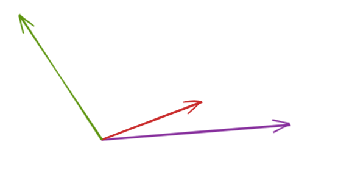
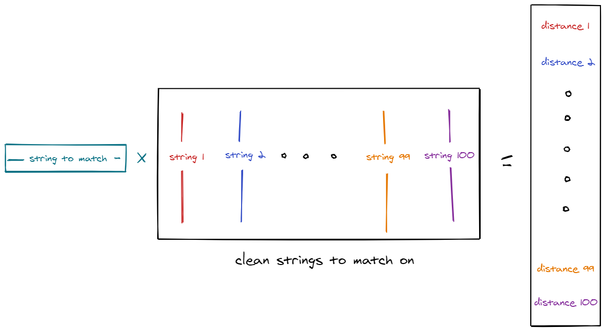

Working with text is tricky. Tiny little typos - like spelling my name as 'Seam' instead of 'Sean' - can mess up any joins, aggregations, and other analytical bits & bobs. The usual way to deal with this is *fuzzy matching*.  
  Fuzzy matching works by matching a word to the next 'closest' word. For example, if you tried to match 'sean' to either 'seam' or 'seed', it'll match to 'seam'. The idea is that you only need to do 1 edit to change 'sean' into 'seam' (switch the letter n to m) but you need to do 2 changes to get to 'seed' (switch a to e, and n to d), so the word 'seam' is *closer* to 'sean' than the word 'seed'.
  
# The problem with fuzzy matching

Fuzzy matching gets very slow, very quick. To see why, imagine you've got a list of 100 names (possibly misspelled), and you want to find the closest match in a list of 1,000 clean names (no typos at all). You'd need to compute the distance between each of the 100 names & each of the 1,000 clean names - so 100,000 comparisons total. If it takes 0.01 seconds to compute the distance between 2 strings, then you'd be waiting for about a minute for the matching to finish.  
  If your lists get bigger, then the time taken to do the match gets longer (if you want to be fancy the time taken is $\mathcal{O}(nm)$, where $n$ and $m$ are the size of your lists). Increase your list from 100 to 1,000 and you'll be waiting for about 16 minutes, double the size of the clean names to 2,000 and you'll be waiting for about 30 minutes.
  
Most day-to-day datasets these days have way more than a few thousand rows, and usually you don't have the time to sit around for a couple of hours waiting for code to run.

# A different approach

Let's looks at something completely different - vectors. In the picture below you can tell that the red vector is closer to the purple vector compared to the green one. If we're able to somehow turn our strings into vectors then we'd be able to compute *vector distances*, instead of string distances.

This sounds like a little change, but switching to vectors gives you a huge speed up for free. This is because computing distances between vectors is done by *matrix multiplication* - which is really fast.

Here's a schematic of how to match vectors. First you turn your list of 'clean' strings into vectors and put them in a matrix. Then you inner product the string you want to match with the clean string matrix, which will give you a vector of distances. Next you find the position of the smallest distance in this vector and use that to index the list of clean strings:

Looking at it this way, the problem becomes linear -  you just do matrix multiplication (on a sparse matrix, $\mathcal{O}(n)$), then find the smallest element of a vector (which is $\mathcal{O}(n)$), then index a list (which is $\mathcal{O}(1)$)!

# Implementation

There's a couple of bits to do:

* Convert strings into vectors
* Make the lookup matrix
* Find the smallest distance, and return the corresponding string

[FIND SOME DATA TO WORK ON]

## Converting strings to vectors
